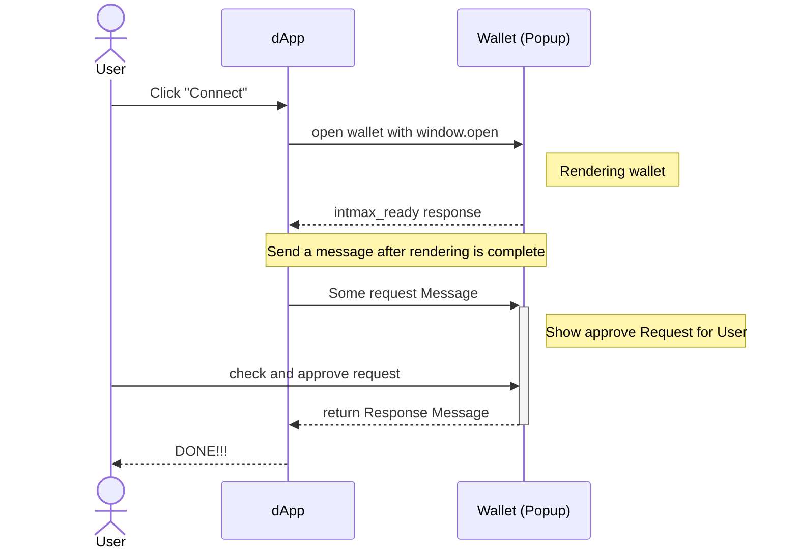

# INTMAX WalletSDK Protocol Proposal

Wallet Connect with Web Wallets and more

## Summary

We propose a protocol for connecting Web Wallets with Dapps.  
This protocol is simple, allowing for various applications.

## Abstract

We propose a protocol that enables direct communication and connection between Web Wallets (wallets provided as web pages) and Dapps.  
This protocol defines the communication methods and data structures to facilitate EIP1193-like interactions between Web Wallets and Dapps.  
Essentially, this protocol is for communication between a Web Wallet and another web page operating in a separate tab, in accordance with the standard.  
Therefore, various extensions and applications are possible. For details, please refer to the Use Cases described later.

## Specification

### Definitions

- `Web Wallet`: A wallet provided as a web page.
- `Dapp`: A web page that connects with a Web Wallet.
- `Child Window`: A window of the Web Wallet opened by a Dapp. Generally, a Popup or Iframe.

### Core Concepts

The basic idea of this protocol is to enable Dapps to operate Web Wallets through an interface compatible with EIP1193. Additionally, it would be beneficial to design it generically so it can be used with chains other than EVM-based ones.

Cross-origin communication between the Child Window and Dapp is conducted using [postMessage](https://developer.mozilla.org/en-US/docs/Web/API/Window/postMessage) and [MessageEvent](https://developer.mozilla.org/en-US/docs/Web/API/MessageEvent).

However, communication between the Child Window and Dapp is only possible while the Child Window is open, and typically, the wallet is opened only when user approval is required, such as for signing. Therefore, some ingenuity is necessary for operations like reading account information.

### Summary of Protocol Flow

The following illustrates the flow when a Dapp calls methods like `eth_requestAccounts` on a Web Wallet.



1. The user clicks the "Connect" button on the dApp.
2. The dApp uses `window.open` to open the wallet.
3. The wallet is opened and initialized.
4. After initialization, the wallet sends a `intmax_ready` message.
5. After confirming initialization, the dApp sends a message like `eth_requestAccounts`.
6. The wallet displays the request to the user.
7. The user checks and approves the request.
8. The wallet sends a response.
9. The dApp receives the response and may close the Window.

### Message Format

**Extended JSON-RPC**  
Many wallets for blockchains like Ethereum provide their operations as JSON-RPC methods.
Based on these, we define a message format that inherits from JSON-RPC as follows.

```typescript
export type AbstractRequest<NS extends string = string, Params = unknown> = {
  id: number;
  namespace: NS | ChainedNamespace<NS>;
  method: string;
  params: Params;
  metadata?: unknown;
};

export type AbstractSuccessResponse<
  NS extends string = string,
  Result = unknown
> = {
  id: number;
  namespace: NS | ChainedNamespace<NS>;
  method: string;
  windowHandling: WindowHandling;
  result: Result;
};

export type AbstractErrorResponse<NS extends string = string> = {
  id: number;
  namespace: NS | ChainedNamespace<NS>;
  method: string;
  windowHandling: WindowHandling;
  error: { code: number; message: string };
};

export type AbstractResponse<NS extends string = string, Result = unknown> =
  | AbstractSuccessResponse<NS, Result>
  | AbstractErrorResponse<NS>;
```

**Namespace**  
Each method requires a Namespace, defining the group of methods.
The Namespace must be included in each request, and it can also include ChainID information.

```typescript
type ChainId = string | number;
type Namespace = "eip155" | "intmax";
type ChainedNamespace = `${Namespace}:${ChainId}`;
```

**Window Handling**  
Specifies how to handle the Wallet's Window after sending a response.
This is useful, for example, when the wallet wants to display an error message.

```typescript
type WindowHandling = "keep" | "close";
```

### Error Codes

Error codes inherit from EIP1193 and add the following error codes.
TODO: Add other error codes

| Status code | Name                | Description                                                     |
| ----------- | ------------------- | --------------------------------------------------------------- |
| 5001        | Chain not Supported | ChainID specified in namespace, but wallet does not support it. |
| 5100        | Popups blocked      | For some reason, the wallet could not be opened.                |

### Methods Types

The protocol defines three types of JSON-RPC methods.

- **notice**: Notification messages from the wallet.
- **approval**: Methods that request approval from the wallet.
- **readonly**: Read-only methods resolved on the dapp side.

**notice**  
A slightly special method type representing notifications from the wallet.
This type of method is implicitly fired by the wallet and notified to the dapp side.
Basically, this type is not used except for methods defined in this protocol.

**approval**  
Methods that require user approval, such as signing.

**readonly**  
Read-only methods like `eip155/eth_accounts`. These are generally cached by the SDK on the dapp side and are not requested from the wallet. However, they are just methods, so it is also possible to handle them on the wallet side.

### Intmax Methods

**intmax_ready**  
A method notifying that the wallet has been initialized and is ready to communicate with the dapp.

- **Params**: None
- **Result**: `IntmaxReadyResult`

```typescript
export type IntmaxReadyResult = {
  supportedNamespaces: Namespace[];
  supportedChains: ChainedNamespace[];
};
```

**intmax_connect**  
A method requesting the user to connect with the wallet.

- **Params**: None
- **Result**: `IntmaxConnectResult`

```typescript
type IntmaxConnectResult = {
  supportedNamespaces: Namespace[];
  supportedChains: ChainedNamespace[];
  accounts: {
    eip155: EthereumAddress[];
  };
};
```

### Eth Approval Methods

The following methods request user approval from the dapp to the wallet. They inherit the schema of each EIP.

- **eth_requestAccounts** - EIP1102
- **eth_sign** - EIP1474
- **eth_signTypedData_v4** - EIP712
- **eth_signTransaction** - EIP1474
- **eth_sendTransaction**- EIP1474
- **wallet_addEthereumChain** - EIP3085
- **wallet_watchAsset** - EIP747

### Eth Readonly Methods

The following methods are expected to be resolved by the SDK on the dapp side. They are not requested from the wallet.
The naming "readonly" may change in the future.

- **eth_accounts** - EIP1193
- **eth_chainId** - EIP1193
- **wallet_switchEthereumChain** - EIP3085

## Note: EIP1193 Event Handling

Due to its specificity, the INTMAX WalletSDK protocol finds it difficult to transmit events. Therefore, it is assumed that EIP1193 events will be resolved by the SDK on the dapp side.

## Use Cases

Here are examples of using the INTMAXWallet SDK protocol. However, this protocol is merely a communication standard, and various applications are possible.

### Connect with Web Wallet

As the most orthodox usage, by integrating DappSDK into a Dapp, it allows connection with web wallets compatible with the protocol. This usage is identical to how protocols like WalletConnect are utilized.

### INTMAX Wallet Launcher

As mentioned, bookmarklet wallets have issues with user experience and security. However, these issues can be resolved by providing a launcher that manages web wallets compatible with Protcol as a browser extension. With this extension, web wallets can be used with the same user experience as extension-based wallets, and security is assured at the same level. This use case is innovative for web wallets and is currently under development.
