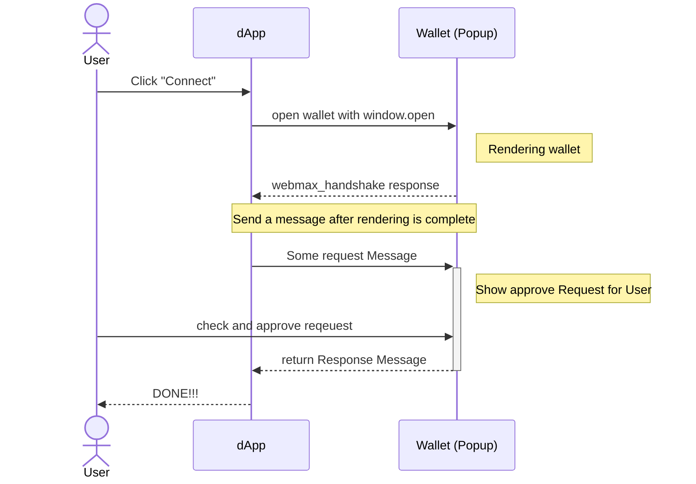

# Webmax Protocol

Wallet Connect with Web Wallets and more

## Summary

Web ウォレットが Dapp と接続するためのプロトコルを提案します。  
このプロトコルは、シンプルなため、様々な応用が可能です。

## Abstract

Web ページとして提供されるウォレット(Web ウォレット)と、Dapp が直接通信して接続できるプロトコルを提案します。  
このプロトコルは、Web ウォレットと Dapp の間で、EIP1193 ライクなやり取りを行えるように、通信方法とデータ構造を定義します。  
本質的にこのプロトコルには、Web ウォレットと別のタブで動作する Web ページが、規格に従って通信するためのプロトコルです。  
そのため、様々な拡張や応用が可能です。詳細はのちのセクションで述べます。

## Specification

### Definitions

- `Web Wallet`: Web ページとして提供されるウォレット
- `Dapp`: Web Wallet と接続される Web ページ
- `Child Window`: Dapp が開く、Web Wallet のウィンドウ。一般的に Popup や Iframe。

### Core Concepts

このプロトコルの基本的な考え方は、Dapp から Web ウォレットを、EIP1193 と互換性のあるインターフェースを介して操作できるようにすることです。ついでに EVM 系以外のチェーンでも利用できるよう、汎用的に設計したほうが良いいでしょう。

Child Window と Dapp の間でのクロスオリジン通信は、[postMessage](https://developer.mozilla.org/en-US/docs/Web/API/Window/postMessage)をと[MessageEvent](https://developer.mozilla.org/en-US/docs/Web/API/MessageEvent)利用して行います。

ただし、Child Window と Dapp 間は、Child Window が開かれている間のみ通信できますが、ウォレットは署名時などのユーザーの承認が必要な操作が必要なタイミングでのみ、開かれることが一般的です。そのため、アカウント情報などの読み取り系の操作は、いくつかの工夫が必要です。

### Summary of Protocol Flow
あるDappから、Webウォレットに対して、eth_requestAccountsなどのメソッドを呼び出すときの流れを以下に示します。



1. ユーザーは dApp で「Connect」ボタンをクリック
2. dApp はウォレットを開くために `window.open` を使用
3. ウォレットが開かれ、初期化される
4. 初期化後、ウォレットは `webmax_handshake` メッセージを送信
5. 初期化を確認後、dApp は`eth_requestAccounts` などのメッセージを送信
6. ウォレットはユーザーにリクエストを表示
7. ユーザーはリクエストを確認し、承認する
8. ウォレットはレスポンスを送信
9. dApp はレスポンスを受け取り、Window を閉じたりする

### Message Format

**Extended JSON-RPC**  
Ethereum などのブロックチェーンの多くのウォレットでは、各操作が JSON-RPC のメソッドとして提供されています。
これらを参考にし、以下のような JSON-RPC を継承したメッセージフォーマットを定義します。

```typescript
export type AbstractRequest<NS extends string = string, Params = unknown> = {
  id: number;
  namespace: NS | ChainedNamespace<NS>;
  method: string;
  params: Params;
  metadata?: unknown;
};

export type AbstractSuccessResponse<
  NS extends string = string,
  Result = unknown
> = {
  id: number;
  namespace: NS | ChainedNamespace<NS>;
  method: string;
  windowHandling: WindowHandling;
  result: Result;
};

export type AbstractErrorResponse<NS extends string = string> = {
  id: number;
  namespace: NS | ChainedNamespace<NS>;
  method: string;
  windowHandling: WindowHandling;
  error: { code: number; message: string };
};

export type AbstractResponse<NS extends string = string, Result = unknown> =
  | AbstractSuccessResponse<NS, Result>
  | AbstractErrorResponse<NS>;
```

**Namespace**  
各メソッドごとに、Namespace が必須で、メソッドのグループを定義します。
Namespace は各リクエストごとに含める必要があり、ChainID の情報も含めることができます。

```typescript
type ChainId = string | number;
type Namespace = "eip155" | "webmax";
type ChainedNamespace = `${Namespace}:${ChainId}`;
```

**Window Handling**
ウォレットがレスポンスを返した後、ウォレットの Window をどのように扱うかを指定します。
ウォレット側でエラーメッセージを表示したい場合などに有効です。

```typescript
type WindowHandling = "keep" | "close";
```

### Error Codes

エラーコードは EIP1193 を継承し、さらに下記のようなエラーコードを追加します。
TODO: 更に詳細なエラーコードを追加する。

| Status code | Name               | Description                                                     |
| ----------- | ------------------ | --------------------------------------------------------------- |
| 5001        | Chain not Suppoted | ChainID specified in namespace, but wallet does not support it. |
| 5100        | Popups blocked     | For some reason the wallet could not be opened.                 |
